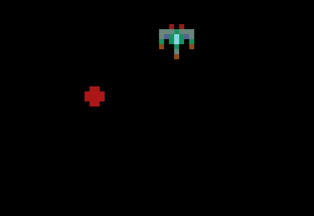

# ldjam2020
Ludum Dare 2020

## Setup

### Phaser 3

Phaser has been added as a submodule `submodules/phaser`. Follow their [Getting Started Guide](https://phaser.io/tutorials/getting-started-phaser3) for setting up your build environment. 

(macOS) I am using VS Code + [http-server](https://www.npmjs.com/package/http-server).

A few quick tests to run:

 #### `test_project/`
 -  (macOS) Run `http-server` in that directory and then copy-paste the address in your browser. 
 -  Click on "**Phaser "Getting Started" Tutorial**". You should see this bouncing around: 

 -  This project includes all of the [Phaser tutorials](https://phaser.io/tutorials/making-your-first-phaser-3-game/part1) as well. Click on the sub-links of the "Phaser Tutorials" header.

 -  I have also done a test run of creating "sprite sheets" and using them in a quick mock-up: 